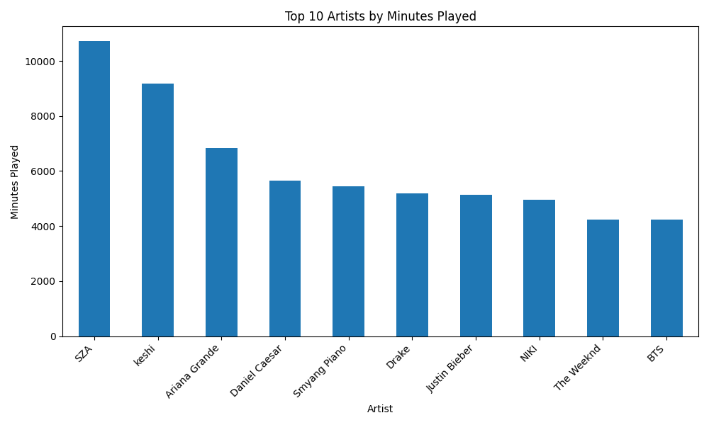
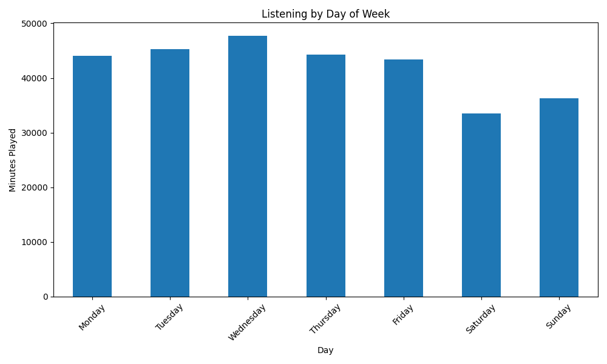
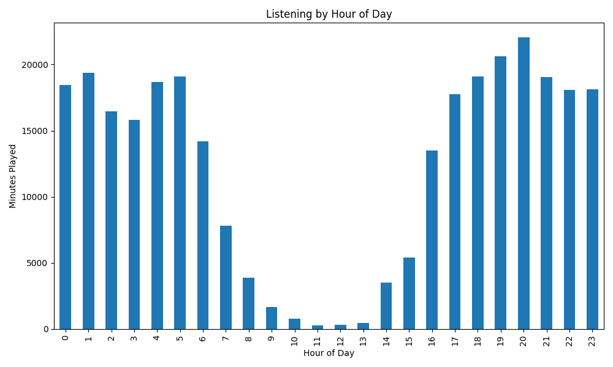

# Spotify Listening History Analysis

## Project Overview

This project analyzes my Spotify extended streaming history using Python, Pandas, and Matplotlib. The goal of this project was to better understand my music listening habits through real personal data.

I explored patterns such as my top artists, top songs, listening trends over time, listening behavior by day of the week, listening behavior by hour of the day, and skip behavior.

## Questions Explored

This project investigates the following questions:

* Who are my top artists by total minutes listened?
* What are my most-played songs?
* How has my listening changed over time?
* Which days of the week do I listen to music the most?
* What hours of the day do I listen to music the most?
* How often do I skip songs?

## Dataset

The dataset comes from my Spotify extended streaming history export. The raw data was provided in JSON format and included listening records such as timestamps, track names, artist names, album names, milliseconds played, platform, and skip behavior.

For privacy reasons, the raw Spotify data is not included in this repository.

## Tools Used

* Python
* Pandas
* Matplotlib
* Jupyter Notebook
* VS Code

## Process

The project followed these main steps:

1. Loaded multiple Spotify JSON files into Python.
2. Combined the files into one Pandas DataFrame.
3. Cleaned the dataset by removing rows without track or artist information.
4. Converted milliseconds played into minutes played.
5. Created new time-based columns such as year, month, day of week, and hour.
6. Grouped and summarized the data to find listening patterns.
7. Created visualizations to communicate the results.

## Key Findings

Some of the main findings from this project were:

* My top artist was SZA. 
* My most-played song was "Good Days" by SZA"
* I listened to the most music in 2022.
* I listened most often on Wednesdays.

## Visualizations

### Top Artists


### Top Songs


### Listening Over Time


### Listening by Day of Week


### Listening by Hour of Day


## Skills Demonstrated

This project demonstrates the following data science skills:

* Loading and working with JSON data
* Data cleaning
* Feature engineering
* Exploratory data analysis
* Grouping and aggregation with Pandas
* Data visualization
* Time-based analysis
* Communicating insights from data

## Project Files

```text
spotify-analysis/
├── data/
├── charts/
├── spotify_analysis.ipynb
├── README.md
├── requirements.txt
└── .gitignore
```

## Notes on Privacy

The raw Spotify data is excluded from this repository because it contains personal listening history and account-related information. The notebook is included to show the analysis process, but the private raw data should not be uploaded publicly.

## Future Improvements

In the future, I could improve this project by:

* Creating more polished visualizations.
* Comparing listening patterns across different years.
* Analyzing changes in genre preferences over time.
* Building an interactive dashboard using Streamlit or Tableau.
* Adding a cleaned and anonymized sample dataset.
